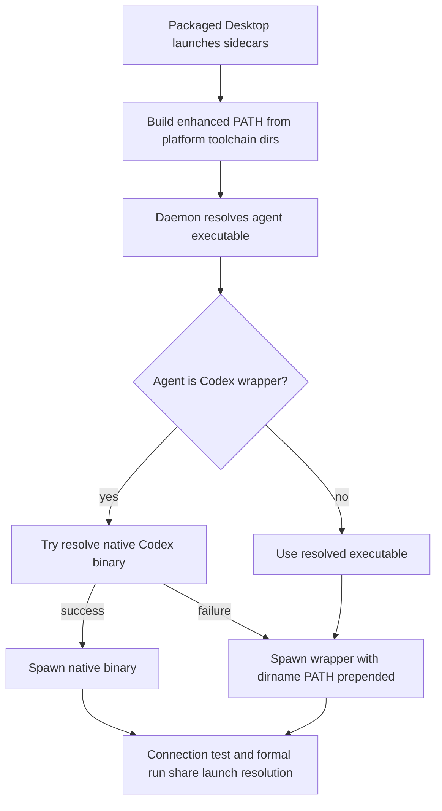

## Overview

### Problem Statement
- Desktop / packaged Open Design 启动 Codex 时，用户本机 `codex` 在 Terminal 可用，但在 Open Design 内测试或实际调用失败。
- 相关报告：#1192 显示 Codex 自动检测成功后 daemon 启动失败；#1066 显示 Mac Arm 上调用 Codex CLI 每次失败。
- 初步根因集中在 macOS GUI 启动环境的 PATH 精简、nvm/npm global 安装路径、Codex Node/ESM wrapper 与 Open Design daemon spawn 环境之间的组合问题。

### Goals
- 将讨论中的几个优化点全部落地：PATH augmentation、resolved executable 目录注入 child PATH、Codex native binary unwrap、连接测试与正式运行共用解析策略、覆盖测试。
- 覆盖 Desktop 双击、Dock、`open -a` 等 LaunchServices 启动路径。
- 保持 Terminal 启动路径和现有 `CODEX_BIN` override 行为兼容。

### Scope
- 涉及 packaged sidecar PATH 构建、daemon agent executable resolution、agent child spawn env、Codex-specific launch resolution、connection test 和正式 run 路径。
- 不引入 mock/demo fallback；解析失败时保留可观察错误和明确诊断。

### Success Criteria
- nvm/npm global 安装的 Codex 在 packaged Desktop 环境中可以完成连接测试并正常运行。
- `CODEX_BIN` 指向 native binary 或 wrapper 时都有明确行为。
- 测试能复现 LaunchServices-style PATH 与 nvm Codex wrapper 场景。

## Research

### Existing System
- Codex runtime 默认 binary 是 `codex`，运行参数使用 `exec --json --skip-git-repo-check --sandbox workspace-write`，prompt 通过 stdin 传入。Source: `apps/daemon/src/runtimes/defs/codex.ts:4-82`
- connection test 使用 `spawn(invocation.command, invocation.args, { stdio: [stdinMode, 'pipe', 'pipe'], shell: false })`。Source: `apps/daemon/src/connectionTest.ts:1082-1103`
- 正式 agent run 使用同类 spawn 形态，并把 stdout/stderr pipe 到 daemon。Source: `apps/daemon/src/server.ts:3748-3769`
- ACP model detection 也使用 `stdio: ['pipe', 'pipe', 'pipe']`。Source: `apps/daemon/src/acp.ts:290-305`
- agent child env 由 `spawnEnvForAgent` 合并 base env 与配置 env；当前没有基于 resolved executable 目录专门调整 PATH。Source: `apps/daemon/src/runtimes/env.ts:23-32`
- Open Design 已有通用 user toolchain 搜索列表，覆盖 Homebrew、npm global、Volta、asdf、pnpm、cargo、nvm/mise/fnm 等路径。Source: `packages/platform/src/index.ts:443-532`
- packaged sidecar 会构建增强 PATH，并把 `wellKnownUserToolchainBins()` 与 POSIX system bins 放进 child env。Source: `apps/packaged/src/sidecars.ts:168-183,287-295`
- daemon executable resolver 也会把 `wellKnownUserToolchainBins()` 加入 PATH 搜索目录。Source: `apps/daemon/src/runtimes/executables.ts:60-89`

### Issue Findings
- #1192 验证了 `codex` 在 Open Design 中检测成功但连接测试失败，用户将 `CODEX_BIN` 指向 Codex native binary 后测试通过。Source: `https://github.com/nexu-io/open-design/issues/1192#issuecomment-4417523942`
- #1066 的报告环境是 macOS / Mac Arm / Codex CLI / Node，Terminal 中 Codex 可用，Open Design 内每次调用失败。Source: `https://github.com/nexu-io/open-design/issues/1066#issuecomment-4417610344`
- nexu-workspace #167 将同类 Desktop GUI 问题归因于 macOS LaunchServices 精简 PATH，导致 brew / nvm / npm-global / `~/.local/bin` 安装的 runtime CLI 对 daemon 不可见。Source: `https://github.com/nexu-io/nexu-workspace/issues/167`
- nexu-workspace PR #199 的核心补丁是为 LaunchServices-style PATH 添加 nvm runtime bin 发现、按版本排序，并加入 hermetic reproductions。Source: `https://github.com/nexu-io/nexu-workspace/pull/199`

### Available Approaches
- **PATH augmentation only**: 继续依赖 `wellKnownUserToolchainBins()` 覆盖 GUI PATH 精简。优点是通用；风险是 Codex wrapper 仍通过 `#!/usr/bin/env node` 与 wrapper 内部 spawn 依赖 PATH。Source: `packages/platform/src/index.ts:443-532`, `apps/packaged/src/sidecars.ts:176-183`
- **Resolved executable dirname prepend**: spawn agent child 前，把 `dirname(resolvedBin)` 放到 child `PATH` 最前，确保 nvm 下的 `codex` wrapper 使用同目录的 `node`。Source: `apps/daemon/src/runtimes/executables.ts:137-170`, `apps/daemon/src/runtimes/env.ts:23-32`
- **Codex native unwrap**: 识别 npm-installed Codex wrapper 并解析 native binary，绕过 Node/ESM wrapper。#1192 已用 `CODEX_BIN` 指向 native binary 验证此路径可行。Source: `https://github.com/nexu-io/open-design/issues/1192#issuecomment-4417523942`

### Constraints & Dependencies
- `CODEX_BIN` 已是 Codex 的配置 override，修复需要保留 override 优先级。Source: `apps/daemon/src/runtimes/executables.ts:9-26,107-128`
- connection test 和正式 run 路径当前各自创建 invocation 和 spawn；修复需要避免两边解析结果漂移。Source: `apps/daemon/src/connectionTest.ts:1092-1103`, `apps/daemon/src/server.ts:3755-3769`
- packaged PATH builder 与 daemon resolver 已共享 `wellKnownUserToolchainBins()`，新增 toolchain 目录或排序逻辑应继续放在 platform 层。Source: `packages/platform/src/index.ts:443-452`

### Key References
- `apps/daemon/src/runtimes/defs/codex.ts:4-82` - Codex runtime definition and args.
- `apps/daemon/src/runtimes/executables.ts:60-170` - agent executable detection and override precedence.
- `apps/daemon/src/runtimes/env.ts:23-32` - child env merge point.
- `apps/packaged/src/sidecars.ts:168-183,287-295` - packaged child PATH construction.
- `packages/platform/src/index.ts:443-532` - shared user toolchain bin discovery.
- `https://github.com/nexu-io/nexu-workspace/pull/199` - nvm PATH augmentation precedent.

## Design

### Architecture Overview


### Change Scope
- `packages/platform`: strengthen nvm version ordering and fixture coverage for `wellKnownUserToolchainBins()`. Source: `packages/platform/src/index.ts:511-532`
- `apps/packaged`: keep packaged daemon/web sidecar PATH assembly sourced from platform toolchain dirs. Source: `apps/packaged/src/sidecars.ts:176-183,287-295`
- `apps/daemon/src/runtimes`: add shared launch-resolution helper that can return selected path, launch path, launch kind, and child PATH adjustments. Source: `apps/daemon/src/runtimes/executables.ts:137-170`
- `apps/daemon/src/connectionTest.ts` and `apps/daemon/src/server.ts`: consume the same launch-resolution result for test and production run. Source: `apps/daemon/src/connectionTest.ts:1092-1103`, `apps/daemon/src/server.ts:3755-3769`

### Design Decisions
- Decision: Implement all discussed fixes in one change: PATH augmentation hardening, child PATH dirname prepend, Codex native unwrap, and shared test/run launch resolution. Source: user request in current discussion; `apps/daemon/src/connectionTest.ts:1092-1103`, `apps/daemon/src/server.ts:3755-3769`
- Decision: Keep `wellKnownUserToolchainBins()` as the single source of truth for GUI-safe toolchain discovery; add nvm ordering behavior there if missing. Source: `packages/platform/src/index.ts:443-452`
- Decision: Before spawning any resolved absolute executable, prepend `dirname(resolvedBin)` to the child PATH. Source: `apps/daemon/src/runtimes/env.ts:23-32`, `apps/daemon/src/runtimes/executables.ts:157-168`
- Decision: For Codex, detect npm wrapper and prefer the native binary when it can be resolved and validated. Source: `https://github.com/nexu-io/open-design/issues/1192#issuecomment-4417523942`
- Decision: Preserve `CODEX_BIN` override priority; if configured path is valid, apply the same native unwrap and PATH-dir prep behavior to that configured path. Source: `apps/daemon/src/runtimes/executables.ts:9-26,107-128`
- Decision: On unwrap failure, fall back to wrapper with enhanced child PATH and surface diagnostics that mention native binary resolution and `CODEX_BIN`. Source: `apps/daemon/src/connectionTest.ts:68-103`

### Why this design
- PATH augmentation handles Desktop GUI launch differences for all agents.
- dirname PATH prepend makes wrapper execution deterministic for nvm/npm installs.
- Codex native unwrap directly addresses the workaround proven in #1192.
- A shared launch-resolution path keeps connection tests and real runs aligned.

### Test Strategy
- Platform unit tests: nvm bin discovery and semver-desc ordering under fixture HOME. Source: `packages/platform/tests/index.test.ts:307-536`
- Packaged unit tests: `resolvePackagedPathEnv()` includes fixture nvm bins under LaunchServices-style PATH. Source: `apps/packaged/src/sidecars.ts:176-183`
- Daemon runtime tests: resolver finds nvm-installed fake Codex under GUI PATH and child env prepends the resolved executable dirname. Source: `apps/daemon/src/runtimes/executables.ts:60-89`, `apps/daemon/src/runtimes/env.ts:23-32`
- Codex unwrap tests: fixture a Codex npm wrapper plus fake `@openai/codex-<platform>` package layout; assert native binary launch path is selected when executable and wrapper fallback is used with diagnostics when missing. Source: `apps/daemon/src/runtimes/defs/codex.ts:4-82`
- Integration-style daemon tests: connection test and formal run use the same launch resolver result. Source: `apps/daemon/src/connectionTest.ts:1092-1103`, `apps/daemon/src/server.ts:3755-3769`

### Pseudocode
```text
resolveAgentLaunch(def, configuredEnv):
  resolution = inspectAgentExecutableResolution(def, configuredEnv)
  if no selectedPath: return missing

  launchPath = resolution.selectedPath
  launchKind = configured/path

  if def.id == codex:
    native = tryResolveCodexNativeBinary(resolution.selectedPath)
    if native is executable:
      launchPath = native
      launchKind = codex-native

  envPatch = prependPathDir(dirname(resolution.selectedPath))
  return { ...resolution, launchPath, launchKind, envPatch }

spawnAgent:
  baseEnv = spawnEnvForAgent(...)
  env = applyLaunchEnvPatch(baseEnv, launch.envPatch)
  spawn(launch.launchPath, args, { env, stdio, cwd, shell:false })
```

### File Structure
- `packages/platform/src/index.ts` - nvm/mise/fnm user toolchain bin ordering and discovery.
- `packages/platform/tests/index.test.ts` - platform toolchain discovery coverage.
- `apps/packaged/src/sidecars.ts` - packaged sidecar PATH env verification.
- `apps/packaged/tests/*` - packaged PATH tests.
- `apps/daemon/src/runtimes/executables.ts` - executable resolution and override precedence.
- `apps/daemon/src/runtimes/launch.ts` - proposed shared launch resolution and child PATH helper.
- `apps/daemon/tests/runtimes/*` - daemon runtime launch tests.
- `apps/daemon/src/connectionTest.ts` - consume shared launch result.
- `apps/daemon/src/server.ts` - consume shared launch result.

### Edge Cases
- Multiple nvm Node versions: prefer highest semver for PATH augmentation, and prefer the selected executable's own directory for its child process.
- `CODEX_BIN` points directly to native binary: use it as launch path after executable validation.
- `CODEX_BIN` points to wrapper: unwrap if possible, otherwise run wrapper with dirname PATH prepended.
- Codex package layout changes: fail visibly with wrapper fallback diagnostics and keep the raw stderr available.
- Windows `.cmd/.bat` shims: preserve existing `createCommandInvocation` and `windowsVerbatimArguments` behavior.

## Plan

- [x] Step 1: Harden shared PATH discovery
  - [x] Substep 1.1 Implement: Add or confirm semver-desc nvm bin ordering in `wellKnownUserToolchainBins()`.
  - [x] Substep 1.2 Implement: Keep packaged PATH and daemon resolver consuming the platform helper.
  - [x] Substep 1.3 Verify: Add fixture HOME tests for LaunchServices-style PATH and nvm bins.
- [x] Step 2: Share agent launch resolution
  - [x] Substep 2.1 Implement: Add launch-resolution type and helper for selected path, launch path, launch kind, and child PATH patch.
  - [x] Substep 2.2 Implement: Prepend selected executable dirname to child PATH for absolute resolved paths.
  - [x] Substep 2.3 Implement: Wire connection test and formal run to the shared helper.
  - [x] Substep 2.4 Verify: Add daemon tests for wrapper shebang resolving node from selected executable dirname.
- [x] Step 3: Add Codex native unwrap
  - [x] Substep 3.1 Implement: Detect Codex npm wrapper and resolve platform native binary.
  - [x] Substep 3.2 Implement: Preserve configured `CODEX_BIN` priority across wrapper and native paths.
  - [x] Substep 3.3 Implement: Add diagnostics and wrapper fallback when native unwrap fails.
  - [x] Substep 3.4 Verify: Add Codex wrapper fixture tests for native success, direct native config, and fallback diagnostics.
- [ ] Step 4: Validate end-to-end behavior
  - [x] Substep 4.1 Verify: Run platform, packaged, and daemon scoped tests.
  - [x] Substep 4.2 Verify: Run `pnpm guard` and `pnpm typecheck`.
  - [ ] Substep 4.3 Verify: Manually test packaged/Desktop Codex connection with nvm npm-installed Codex.

## Notes

<!-- Optional sections — add what's relevant. -->

### Implementation

- `packages/platform/src/index.ts` - sorted versioned mise/nvm/fnm Node toolchain bins deterministically by semver descending.
- `packages/platform/tests/index.test.ts` - added fixture coverage for LaunchServices-style PATH and nvm version ordering.
- `apps/daemon/src/runtimes/launch.ts` - added shared agent launch resolution, child PATH prepend, Codex native binary lookup, and wrapper fallback diagnostics.
- `apps/daemon/src/connectionTest.ts` - wired connection tests to shared launch resolution and child PATH patching.
- `apps/daemon/src/server.ts` - wired formal agent runs to shared launch resolution and child PATH patching.
- `apps/daemon/src/agents.ts`, `apps/daemon/tests/runtimes/helpers/test-helpers.ts` - exported launch helpers.
- `apps/daemon/tests/runtimes/launch.test.ts` - covered PATH prepend/dedupe, minimal-PATH nvm Codex resolution, native unwrap success, direct native `CODEX_BIN`, and wrapper fallback diagnostics.

### Verification

- Passed: `pnpm --filter @open-design/platform test`.
- Passed: `pnpm --filter @open-design/daemon exec vitest run -c vitest.config.ts tests/runtimes/launch.test.ts tests/runtimes/executables.test.ts tests/runtimes/env-and-detection.test.ts`.
- Passed: `pnpm --filter @open-design/daemon exec vitest run -c vitest.config.ts tests/runtimes/launch.test.ts` after adding direct native `CODEX_BIN` coverage.
- Passed: `pnpm --filter @open-design/packaged exec vitest run -c vitest.config.ts tests/sidecars.test.ts`.
- Passed: `pnpm guard`.
- Initial `pnpm typecheck` failed because workspace dependencies were not installed for `apps/telemetry-worker`; after `pnpm install`, `pnpm typecheck` passed.
- Pending: packaged/Desktop manual Codex connection validation with an nvm npm-installed Codex.
